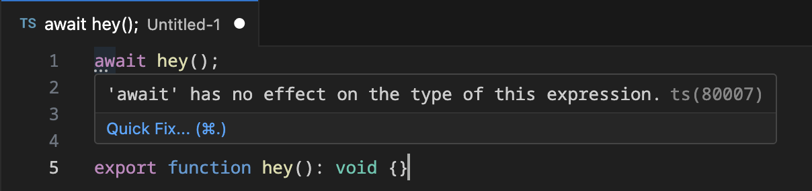
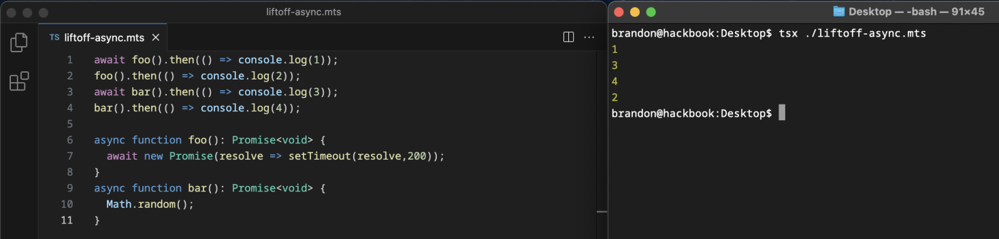

# Liftoff

I've been conjuring up this peculiar idea over the last few days, whether it could be a nice idea for a language to flip the use of implicit/explicit handling of async vs sync code. This is the general idea, to help show the concept initially:

| async-await           | liftoff                 |
|-----------------------|-------------------------|
| `new Promise()`       | `liftoff new Promise()` |
| `await new Promise()` | `new Promise()`         |

Here's a bunch of the threads about the concepts for it:

> Related to `await`, I've started thinking of it like a modifier to making something synchronous or not also.
> And it's up to the implementation to provide it's own way of making something async.
> Rather than trying to think of it like it's it's own thing (It is, but not thinking of it like that feels more intutive in a way).

> Are there any languages which do sync-first, rather than async-first?
> By that, I mean, it's a modifier to make the async call go off of the main thread pool, rather than implicitly doing that, an opting-in to 'synchronous'-like behavior, how JS and other languages do it?
> I'm trying to figure out why it's not that way.
> So rather than opting-in to `await`'s behavior, you'd instead opt-in to not waiting for the `Promise`.

So the goal isn't to remove either asynchronous, nor synchronous calls from the language, but rather to flip which one is managed explicitly, and which one is the implicit behavior.

The idea stems from this video I saw a while back.
It's outlook on JS's `async` gave me the idea of that it could be an alternative way of handing sync vs async code paths:

[What Color Is Your Function | Prime Reacts](https://www.youtube.com/watch?v=MoKe4zvtNzA)

While writing these, realized another possible good equating here is if you think of everything as like top-level `await`, where everything is *implicitly* `await`ed. You then use the `liftoff` keyword to allow that task to go on it's own journey, allowing the calls that follow it to execute while it runs by itself.

So the simple way to put it, just flip the use of the `await` keyword to be for when you want things to not be `await`-ed.

Onto some more examples:

> But say if you could implicitly use `import("node:fs/promises").readFile` synchronously, then use a keyword before calling it to make it work like a non-`await`ed call in current JS.
> ```ts
> import { readFile } from "node:fs/promises"; // note the lack of the `-Sync` prefix
> 
> const example: Buffer = readFile("./example.txt"); // blocking
> const exampleAsync: Promise<Buffer> = liftoff readFile("./example.txt");
> ```

I should have brought this statement to the forefront of this explainer, but this should be heavily stressed in the meantime, since this project is completely a random idea of mine:

> Not saying this [concept] is nicer, just pointing out it's interesting that languages default to async calls with implicit syntax, then use explicit syntax to make them synchronous again (hence, `await readFile("./example.txt")`).

HoldYourWaffle made this nice connection also:

> Ah wait hang on, so you're saying to move the async-explicitness from declaration site to usage site.
> They're both explicit, but in different places.

This continued to further discussion and distinctions:

<details>
  <summary>Silent Performance Concerns (Extended commentary)</summary>

  > **HoldYourWaffle** -
  > That'd be a boilerplate nightmare though.
  > Async functions have to be designed to be async, so it makes sense that they're inherently async at declaration.
  > You generally can't "asyncify" a random sync function.
  > 
  > **Offroaders123** -
  > If the implementer doesn't want to block their usecase of the heavy task, they would handle the use of `liftoff`.
  > 
  > **HoldYourWaffle** -
  > For async functions that's the default now, as it should be.
  > Adding `liftoff` would just add boilerplate that could be forgotten.
  > 
  > **Offroaders123** -
  > That's no different than forgetting `await` though.
  > 
  > **HoldYourWaffle** -
  > I can see some value in syntax sugar for "fire and forget" function calls, but those are rare.
  > The current boilerplate isn't too horrifying for those cases.
  > 
  > **HoldYourWaffle** -
  > Forgetting `await` explicitly makes things not work.
  > Forgetting `liftoff` would silently introduce performance problems.
  > Wait wait wait wait,
  > No hang on.
  > That doesn't make sense.
  > Are you saying `liftoff` is the equivalent of `await new Thread(...).start()`?
  > As in, execute in a different thread,
  > then wait for the result?
  > 
  > **Offroaders123** -
  > No `liftoff` is the behavior of not adding `await`.
  > 
  > **HoldYourWaffle** -
  > So a fire and forget call?
  > 
  > **Offroaders123** -
  > Yeah.
  > 
  > **HoldYourWaffle** -
  > That's completely different from forgetting `await`.
  > Forgetting `await` is "I can't use the result yet".
  > Forgetting `liftoff` is "I'm silently blocking the main thread even though I don't care about the result of this thing".
  > I could see some value in syntax sugar for "fire and forget", but the applications would be minimal.
  > 
  > **Offroaders123** -
  > So I think this is likely the tradeoff between the two (*In reference to HoldYourWaffle's message above*).
  > `await` ensures you know what you are calling when you call it, while the other just doesn't become apparent.

</details>

> One could argue this setup isn't worthwhile because you could leak things unintentionally.
> But that's the same now as just doing something like this:
> ```js
> async function hi(){
>   // oops, forgot `await`
>   new Promise(resolve => setTimeout(resolve,2500));
> }
> 
> hi().then(() => console.log("done!")); // this is inaccurate because the async job goes off into the abyss
> ```

Another case I thought that would need handling for this keyword idea, are non-async implementations.



If you try using `liftoff` on non-`async` (More specifically, `Promise`) results, what should it do?

Considering the fact that `async` functions implicitly wrap their return values with `Promise`s, I'm initially thinking that `liftoff` should do the same.

> Say if you were to try and do:
> ```js
> const hi = liftoff console.log("heya");
> ```
> Should `hi` be `void`, or `Promise<void>`?
> With the case of `liftoff`, I think `Promise<void>`, and that it would have the same kind of error in a TypeScript setting:
> ```
> 'liftoff' has no effect on the type of this expression.
> ```

And in concept with the concern with calling just *any* function with `liftoff`, the `async` modifier (or maybe a different name would make sense, like `plane`, hehe) could instead be used to define whether a function could be made quicker when used asynchronously.

> You could mark your functions as `async` still, but it won't effect how methods are called inside of it, rather it would be for marking whether it's calls can be `liftoff`-ed.
> So `readFile()` would be `async function readFile(path: string): Buffer` essentially, and the `async` part marks whether it can be used with `liftoff` and have any different execution times to that of just the plain sync calling of it.

Honestly I'm not completely sure about the handling of this at the moment, this is where this stage of the concept is breaking it down from being a valid idea. I think the issue is that this makes all synchronous code essentially just `await`ed `Promise`s, which would dramatically slow everything down, because everything would have to be `Promise`s under the hood.

> **HoldYourWaffle** -
> How can it have different execution times depending on how you call it?
> 
> **Offroaders123** -
> Because the implementation of Node's `readFile()` inherently takes time, it's just whether or not it should pause the main thread or not.
> And continuing down that route, any function call takes time to execute, but it can't just be made `async` by adding `async` to it, that's not going to make it any faster.
> But hmm, I wonder if that could actually be implemented if you were to use this syntax.
> `Math.random()` isn't any less blocking inside of `Promise.resolve(Math.random)`, for example.
> 
> **HoldYourWaffle** -
> Yeah exactly, that's sort of my point.
> 
> **Offroaders123** -
> But say if `Math.random()` were heavy, you could move that to a thread and then use that with `liftoff`/`Promise.resolve()`, that could have potential at being faster.

We then went on to cover this demo, for brevity in which both functions are `Promise` returning `async` functions (the numbers are for the calls themselves, not for their resolution order):

```ts
foo();         // 1
liftoff foo(); // 2
bar();         // 3
liftoff bar(); // 4
```

This is the equivalent set of functions in a standard async-await scenario:

```js
await foo(); // 1
foo();       // 2
await bar(); // 3
bar();       // 4
```

